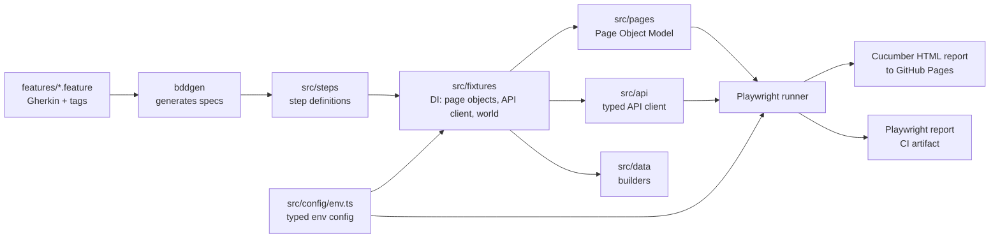

# Playwright BDD Demo Framework

[](https://github.com/BaranDoganbas/playwright-bdd-demo/actions/workflows/e2e.yml)
[](LICENSE)
[](.nvmrc)

An end-to-end test framework built with [Playwright](https://playwright.dev) and
[playwright-bdd](https://github.com/vitalets/playwright-bdd). It follows the same structure I use
day to day on enterprise software, rebuilt here against public demo targets since the real suite
stays private.

**Live Cucumber report:** https://barandoganbas.github.io/playwright-bdd-demo/
(CI regenerates it on every push, plus a weekly run.)

## Quick start

```bash
git clone https://github.com/BaranDoganbas/playwright-bdd-demo.git
cd playwright-bdd-demo
npm ci
npx playwright install chromium
npm test
```

No `.env` is required. Every setting defaults to the public demo targets described under
[Configuration](#configuration), so a fresh clone runs green in about ten seconds.

## Running a subset

| Command                   | Runs                                              |
| ------------------------- | ------------------------------------------------- |
| `npm test`                | Everything: 8 scenarios plus the auth setup       |
| `npm run test:smoke`      | The 3 `@smoke` scenarios (~5s)                    |
| `npm run test:regression` | The full `@regression` set                        |
| `npm run test:ui`         | `setup` + `auth` + `ui` projects                  |
| `npm run test:api`        | `api` project only                                |
| `npm run report`          | Open the Playwright HTML report from the last run |
| `npm run lint`            | ESLint (type-aware + Playwright rules)            |
| `npm run lint:fix`        | ESLint with autofix                               |
| `npm run format`          | Prettier, write                                   |
| `npm run format:check`    | Prettier, verify only (what CI runs)              |
| `npm run typecheck`       | `tsc --noEmit`                                    |

Ad-hoc selections work too:

```bash
npx playwright test --grep @api            # by tag
npx playwright test --project=auth         # by project
TAGS='@smoke and not @api' npm test        # by tag expression, at generation time
```

## Layout

```
├── features/
│   ├── auth/        # login flows (intentionally unauthenticated)
│   ├── ui/          # shopping flows (reuse storage state)
│   └── api/         # booking CRUD lifecycle
├── src/
│   ├── api/         # BookerClient: transport policy + typed responses
│   ├── config/      # env.ts, the only reader of process.env
│   ├── data/        # test-data builders (aBooking)
│   ├── pages/       # Page Objects (Login, Inventory, Cart, Checkout)
│   ├── steps/       # step definitions (ui / api)
│   ├── fixtures/    # custom test with injected page objects, client, world
│   ├── setup/       # auth.setup.ts, persists storage state
│   └── support/     # small shared helpers
├── eslint.config.mjs
├── playwright.config.ts
├── .env.example
└── .github/workflows/e2e.yml
```



## Design notes

### Storage-state auth

Login is worth testing once, which the `auth` project does. Everywhere else it is overhead, so the
`setup` project signs in a single time and persists the session. That cuts suite time and takes
login out of the flakiness budget for functional scenarios. The setup drives the same page objects
as the tests, so a changed login selector fails once with a clear message instead of timing out in
every downstream scenario.

### One project per context

Authenticated and unauthenticated flows need different browser contexts and shouldn't share state,
so they are separate Playwright projects joined by a `dependencies` chain. Execution order becomes
explicit, and CI can run `--project=api` without touching the UI suite.

### Scenario state

BDD steps have to stay stateless if they are going to be reusable, so `world` is the only channel
for passing values between steps, scoped per scenario. It is typed rather than
`Record<string, unknown>`, which turns a mistyped field into a compile error. Reads go through
`fromWorld()`, so a mis-ordered scenario reports which value is missing and which step sets it
rather than failing with `undefined` somewhere inside a request.

### Configuration

[`src/config/env.ts`](src/config/env.ts) is the only module that reads `process.env`. Scattered
reads make "which environment did this run against?" hard to answer and let a typo fall back to
something wrong without saying so. Here the values are parsed and validated once, and an invalid
one aborts the run before any test starts, listing every problem it found:

```
Invalid test environment configuration:
  BASE_URL: must be an absolute URL (got "saucedemo.com")
  WORKERS: must be an integer >= 1 (got "abc")
```

### Test data

The API target is a shared public sandbox that keeps what anyone writes to it and offers search by
name. A fixed payload would collide with parallel workers and with other people's data, so
[`aBooking()`](src/data/booking.ts) randomises the surname and computes stay dates relative to
today. Fields are overridable, so a scenario states only what it actually cares about.

### The API client

`BookerClient` holds the transport concerns: per-request timeouts, the cookie-based auth quirk, and
one retry. Steps stay about behaviour. Exactly one request retries, the auth token, because it is a
precondition rather than a subject under test and it is where a sandbox cold start turns a healthy
run red. The client contains no assertions at all, which is what keeps "retry the token, never
retry an assertion" true in practice.

### Failure messages

API assertions carry the response status and body, so a red CI run can usually be diagnosed without
reproducing it locally.

### Selectors

`data-test` attributes throughout. They survive UI refactors and act as an explicit contract with
developers about which hooks are safe to rely on. The config points Playwright's `testIdAttribute`
at `data-test`, so page objects read `getByTestId('username')` rather than repeating an attribute
selector, and switching the convention later is a one-line change.

### Gherkin that stays readable

A scenario per input does not scale. Where several cases share one shape, the feature file uses a
`Scenario Outline` with an `Examples` table, so adding a rejected sign-in case is a row rather than
another near-identical scenario. Where a step repeats with different values, it takes a data table.
Both keep the feature file about behaviour instead of about repetition.

### Linting

`tsc` will not tell you that an `await` is missing on an assertion; the test simply passes. Type-aware
ESLint does, via `no-floating-promises`, which is the highest-value rule available in an async test
suite. `expect-expect` is configured to recognise page-object assertion methods, so delegating an
assertion doesn't make a test look assertion-free.

## Configuration

Values come from environment variables. [`.env.example`](.env.example) documents each one; copy it
to `.env` to override locally. `.env` is gitignored, and real process environment variables always
win over the file.

| Variable                            | Default                                | Purpose                                    |
| ----------------------------------- | -------------------------------------- | ------------------------------------------ |
| `BASE_URL`                          | `https://www.saucedemo.com`            | UI target                                  |
| `API_BASE_URL`                      | `https://restful-booker.herokuapp.com` | API target                                 |
| `STANDARD_USER` / `USER_PASSWORD`   | `standard_user` / `secret_sauce`       | UI account for storage state               |
| `API_USER` / `API_PASSWORD`         | `admin` / `password123`                | API account for the token call             |
| `BROWSER`                           | `chromium`                             | `chromium`, `firefox` or `webkit`          |
| `HEADLESS`                          | `true`                                 | Set to `false` to watch a run locally      |
| `WORKERS`                           | auto locally, `2` in CI                | Parallelism                                |
| `RETRIES`                           | `0` locally, `2` in CI                 | Retries per test                           |
| `TAGS`                              | _unset_                                | Tag expression, filters at generation time |
| `API_TIMEOUT` / `API_TOKEN_RETRIES` | `30000` / `3`                          | API resilience tuning                      |
| `STORAGE_STATE`                     | `.auth/user.json`                      | Where the session is persisted             |

## Tags

Two independent axes, so any slice of the suite is expressible:

| Axis  | Tags                    | Applied at    | Meaning                                          |
| ----- | ----------------------- | ------------- | ------------------------------------------------ |
| Area  | `@ui`, `@auth`, `@api`  | Feature level | Which part of the system the scenario exercises  |
| Depth | `@smoke`, `@regression` | See below     | How much of the suite you're willing to wait for |

`@regression` sits on the feature, so every scenario inherits it and it always means the full
suite. `@smoke` sits on individual scenarios and is a strict subset: the minimal path proving the
system is alive. Right now that is three scenarios, one per area, covering sign-in, a completed
order and the booking CRUD lifecycle. No edge cases, no negative paths. A new scenario needs no
`@regression` tag; add `@smoke` only if the suite would be meaningless without it. Once smoke grows
past roughly five scenarios it has stopped being smoke.

Filtering works two ways. `--grep @smoke`, used by `npm run test:smoke`, filters at run time and is
cross-platform with no extra dependency. `TAGS='@ui and not @slow'` filters at generation time via
`bddgen`, so unwanted specs are never produced, which suits CI where an env var is the natural knob.

## Targets

| Suite        | Target                                                 | Why                                                |
| ------------ | ------------------------------------------------------ | -------------------------------------------------- |
| `auth`, `ui` | [SauceDemo](https://www.saucedemo.com)                 | Stable public demo shop, keeps the CI report green |
| `api`        | [RESTful Booker](https://restful-booker.herokuapp.com) | Public API with real auth + CRUD semantics         |

Both are public demo systems whose credentials are published on the sites themselves, which is why
they can be defaulted in config. Pointing the framework at a real environment means supplying the
variables above; the config module is written so that dropping a default makes a variable
hard-required.

## CI

`.github/workflows/e2e.yml` runs on push, PR, a weekly schedule and manual dispatch:

- `quality` runs lint, format check and typecheck. It runs alongside the suite, so a lint error
  fails the workflow without waiting for the browser tests.
- `test` installs dependencies, restores cached browser binaries keyed on the resolved Playwright
  version, runs all projects and uploads both reports.
- `deploy-report` publishes the Cucumber report to GitHub Pages from `main`, including when tests
  fail, since a red report is the one worth reading.

Retries (2) and a fixed worker count apply in CI only. Locally the suite runs with no retries so
flakiness shows up instead of being papered over.

## Contributing

See [CONTRIBUTING.md](CONTRIBUTING.md) for how to add a feature file, wire up steps, and what to run
before opening a PR.

---

Built by Baran Doğanbaş, QA Automation Engineer. Portfolio: https://barandoganbas.netlify.app
