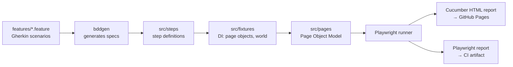

# Playwright BDD Demo Framework

An end-to-end test framework built with [Playwright](https://playwright.dev) and [playwright-bdd](https://github.com/vitalets/playwright-bdd), demonstrating the architecture I build and run daily against enterprise software, recreated here against public demo targets, since production code stays private.

**Live Cucumber report:** https://[USERNAME].github.io/[REPO]/ _(regenerated by CI on every push + weekly)_

## What it demonstrates

- **BDD with Gherkin:** feature files readable by non-engineers, wired to TypeScript step definitions
- **Page Object Model:** locators and interactions isolated from test logic
- **Storage-state authentication:** login runs once in a `setup` project; functional scenarios never repeat it
- **Multi-project configuration:** `auth` (unauthenticated login flows), `ui` (authenticated shopping flows), `api` (token-based CRUD) run as isolated Playwright projects with dependencies
- **API testing without extra tooling:** Playwright's built-in `request` fixture against RESTful Booker (auth token, create/read/update/delete lifecycle)
- **CI-published reporting:** Cucumber HTML report deployed to GitHub Pages on every run

## Architecture



```
├── features/
│   ├── auth/        # login flows (intentionally unauthenticated)
│   ├── ui/          # shopping flows (reuse storage state)
│   └── api/         # booking CRUD lifecycle
├── src/
│   ├── pages/       # Page Objects (Login, Inventory, Cart, Checkout)
│   ├── steps/       # step definitions (ui / api)
│   ├── fixtures/    # custom test with injected page objects + scenario "world"
│   └── setup/       # auth.setup.ts, persists storage state
├── playwright.config.ts
└── .github/workflows/e2e.yml
```

## Design decisions

**Why storage-state auth?** Login is a test subject exactly once (the `auth` project). Everywhere else it's overhead, so the `setup` project signs in one time and persists the session, cutting suite time and removing login as a flakiness source from functional scenarios.

**Why multi-project?** Authenticated and unauthenticated flows have different browser contexts and shouldn't share state. Splitting them into Playwright projects with a `dependencies` chain makes the execution order explicit and lets CI run `--project=api` independently of the UI suite.

**Why a scenario `world` fixture?** BDD steps must stay stateless and reusable; the `world` object is the single sanctioned channel for passing values between steps (e.g. a created booking id), scoped per scenario.

**Why data-test selectors?** They survive UI refactors and encode a contract with developers about what's stable.

## Targets

| Suite        | Target                                                 | Why                                                 |
| ------------ | ------------------------------------------------------ | --------------------------------------------------- |
| `auth`, `ui` | [SauceDemo](https://www.saucedemo.com)                 | Stable public demo shop, keeps the CI report green |
| `api`        | [RESTful Booker](https://restful-booker.herokuapp.com) | Public API with real auth + CRUD semantics          |

## Running locally

```bash
npm ci
npx playwright install chromium
npm test              # all projects
npm run test:ui       # setup + auth + ui
npm run test:api      # api only
npm run report        # open Playwright HTML report
```

---

_Built by Baran Doğanbaş, QA Automation Engineer. Portfolio: https://barandoganbas.netlify.app_
